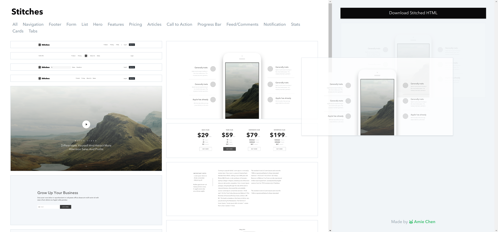

# Stitches


test
A simple, fast web app to generate html based on a collection of commonly used user interface patterns.



## Running it locally


```
npm start
```
this compiles `client.js` into `bundle.js`, run `postcss` for css changes as well as starts the node app.

